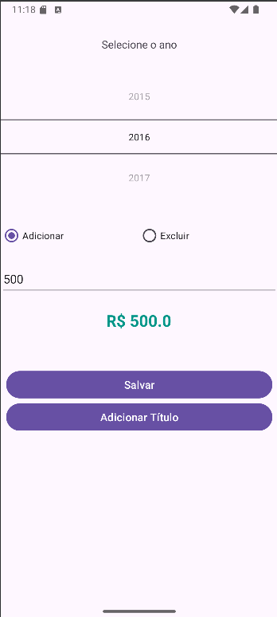

# Annual Revenue App for MEI 📱
This is a simple project developed as part of an academic assignment to explore the use of Android Studio with Java. The app allows users to:

1) Select a year.
2) Input a revenue amount.
3) Save the data locally using SharedPreferences.

## Demo

## 🛠️ Technologies Used
**- Android Studio**: Development environment.
**- Java**: Programming language.
**- SharedPreferences**: For simple and persistent local storage.

## 📋 Features
**- Year Selection**: Choose the desired year using a spinner.
**- Revenue Input**: Enter the annual revenue in a designated field.
**- Local Storage**: Save the data using SharedPreferences, ensuring persistence even after the app is closed.

## 🎯 Academic Objective
The goal of this project is to explore the following concepts:

- Creating simple user interfaces using XML.
- Handling persistent data with SharedPreferences.
- Understanding the basic structure of an Android project in Java.